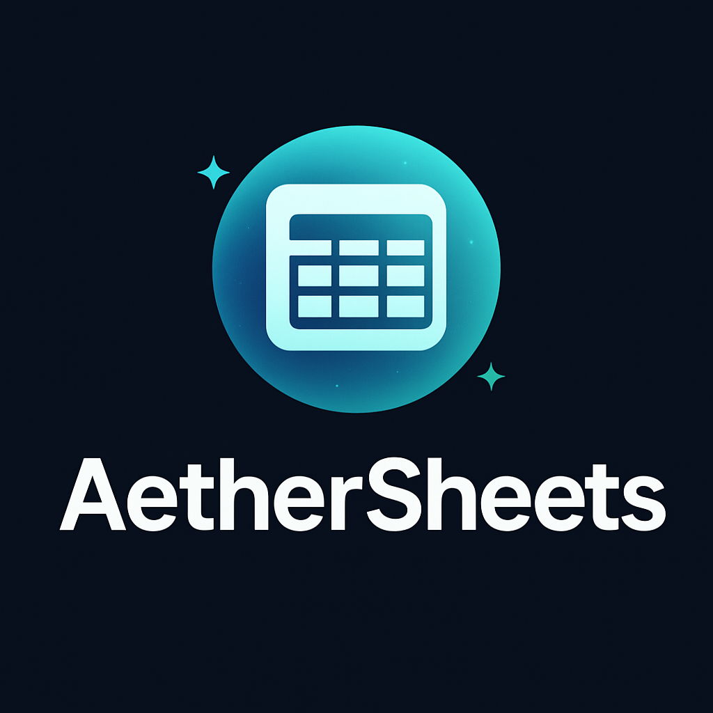

<div align="center">

</div>

## Overview

AetherSheets is a lightweight pipeline that connects Google Sheets with Large Language Models to automatically process and enrich data. Input company names in one sheet, run the pipeline, and get AI-generated research summaries in a new sheet.

## Features

- **Multi-Agent Research System** using LangGraph for coordinated company analysis
- **Comprehensive Company Research** across 4 dimensions: overview, leadership, financials, and recent news
- **Google Sheets Integration** for seamless input/output workflows
- **CLI Interface** with dry-run and verbose logging options
- **Real-time Web Search** via Tavily API for current information

## Installation

### Prerequisites
- Python ≥ 3.12
- Google Sheets API credentials  
- OpenAI API key
- Tavily API key

### Setup
```bash
# Clone and install
git clone <repository-url>
cd <repo-name>
uv sync

# Configure environment
cp .env.sample .env
# Edit .env with your API keys
```

### Configuration

Create `.env` file with:
```env
OPENAI_API_KEY=your_openai_api_key_here
TAVILY_API_KEY=your_tavily_api_key_here
GOOGLE_SHEET_ACCESS_CREDS=<stringify-of-json-creds>
```

**Google Sheets Setup:**
1. Create Google Cloud Project and enable Sheets + Drive APIs
2. Create Service Account and download credentials JSON
3. Stringify the credential JSON to [this online tools](https://jsonformatter.org/json-stringify-online)
4. Copy stringify JSON content to `GOOGLE_SHEET_ACCESS_CREDS` in .env
5. Share your Google Sheet with the service account email

## Running

### Basic Usage
```bash
# Process companies from Google Sheet
uv run python src/main.py <spreadsheet_id>

# Custom configuration
uv run python src/main.py <spreadsheet_id> \
    --input-worksheet "Companies" \
    --input-column "Company Name" \
    --output-worksheet "Research Results"

# Debug and preview
uv run python src/main.py <spreadsheet_id> --verbose --dry-run
```

### Input/Output Format Spreadsheet

**Input Sheet:**
```
| Company Name |
|-------------|
| Apple Inc   |
| Tesla       |
```

**Output Sheet:**
```
| Company   | Summary                                    |
|-----------|-------------------------------------------|  
| Apple Inc | **Company Overview**: Apple Inc is a...   |
| Tesla     | **Company Overview**: Tesla Inc is...     |
```

## Docker Usage

### Build and Run with Docker

```bash
# Build the Docker image
make docker-build
# or manually: docker build -t aethersheets .

# Run the application in container
make docker-run
# or manually: docker run --rm -it -v $(pwd):/app -v $(pwd)/.env:/app/.env aethersheets uv run python src/main.py

# Start interactive bash shell in container
make docker-shell
# or manually: docker run --rm -it -v $(pwd):/app -v $(pwd)/.env:/app/.env aethersheets
```

### Makefile Commands

The project includes a Makefile for common development tasks:

```bash
make help          # Show all available commands
make install       # Install dependencies using uv
make run           # Run the application
make clean         # Clean cache and temporary files
make docker-build  # Build Docker image
make docker-run    # Run application in Docker
make docker-shell  # Interactive bash shell in Docker
```

## TechStack

- **Python 3.12+** - Core runtime
- **LangGraph** - Multi-agent workflow coordination
- **OpenAI GPT** - AI content generation
- **Tavily API** - Real-time web search
- **Google Sheets API** - Spreadsheet integration
- **structlog** - Structured logging
- **uv** - Package management
- **Docker** - Containerization for consistent environments