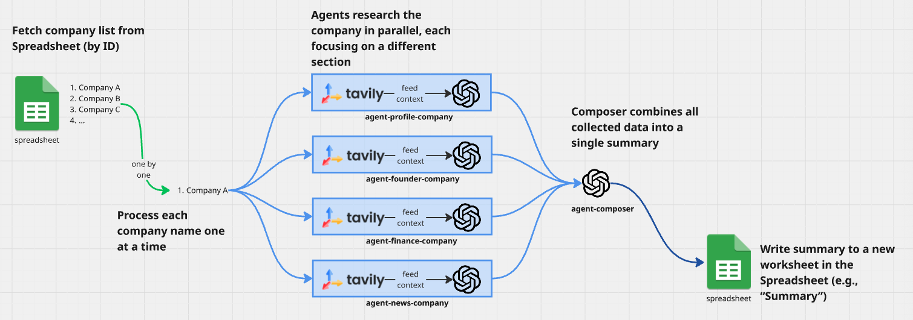

# Company Research System Design

## Project Overview

This project creates an automated system to research companies and generate summaries. The workflow is straightforward, but achieving high-quality, consistent results requires careful design and implementation.

## Development Approach

I broke down this project into manageable steps:

1. **API Setup**: Configure Google API keys (Drive and Spreadsheet access), OpenAI API and Tavily API
2. **Core Functions**: Build individual functions for spreadsheet operations, LLM calls, and web scraping
3. **Agent Development**: Create specialized research agents with optimized prompts
4. **Integration**: Combine all components into a cohesive service
5. **Testing & Optimization**: Fine-tune prompts and evaluate performance
6. **Documentation**: Create comprehensive project documentation

While technical implementation details can be learned from documentation and AI assistance, I want to focus on explaining the agent design strategy for company research.

## System Architecture

### Process Flow

1. **Input Processing**: The system reads company names from a Google Spreadsheet using the sheet ID, processing each company individually.

2. **Parallel Research**: For each company, multiple specialized AI agents work simultaneously, each focusing on a specific research area:
   - **About Agent**: Company profile and business model
   - **Founder Agent**: Leadership and founding information  
   - **Finance Agent**: Financial data and business metrics
   - **News Agent**: Recent developments and market updates

3. **Information Synthesis**: All agents send their findings to a Composer Agent that combines the research into a comprehensive company summary.

4. **Output Generation**: The final summary is written to a new worksheet in the same Google Spreadsheet (e.g., "Company_Summaries").

## Technology Choices

### Why Tavily for Web Scraping?

Tavily excels at web scraping and information retrieval from the internet. Since LLMs have knowledge cutoffs and lack real-time information, we need external tools to provide current context. Tavily makes this process reliable and efficient.

### Why Multi-Agent Architecture?

LLMs often struggle with complex, multi-faceted tasks, leading to confusion and hallucinations when given too many instructions simultaneously. By splitting research into focused, specialized agents:

- **Each agent becomes expert** in its specific domain
- **Information quality improves** through focused attention
- **System becomes more controllable** and debuggable
- **Incremental improvements** can be made to individual agents
- **Reduces cognitive overload** that leads to inconsistent outputs

## Prompt Engineering Strategy

The prompt design follows established best practices:

### Core Principles

1. **Clear Task Definition**: Each agent has a specific, well-defined objective
2. **Uncertainty Handling**: Agents are instructed to acknowledge when information is unavailable or uncertain
3. **Constraint Setting**: Clear boundaries prevent agents from going off-topic or making assumptions
4. **Example-Driven Learning**: Concrete examples demonstrate expected output format and quality
5. **Structured Output**: it can be JSON schemas ensure predictable, or  Markdown Structure, or table of content structure.

### Design Evolution

Initially, I experimented with Chain of Thought prompting using 5-step reasoning processes. However, this approach resulted in:
- Inconsistent output structures
- Unnecessary complexity for straightforward tasks
- LLM "overthinking" leading to reduced reliability

For focused research tasks, simpler, clearer instructions proved more effective than complex reasoning chains.

## Areas for Future Enhancement

### Web Scraping Optimization
There is always room for improvement. I notice some information is not accurate, so maybe we can do this:
- **Search Depth**: Implement deeper, more comprehensive and more accurate web searches
- **Query Refinement**: Develop smarter search query generation
- **Source Diversification**: Expand beyond initial search results

### LLM Improvements
- **Cost Optimization**: Explore different models for cost-effectiveness
- **Performance Evaluation**: Implement systematic quality assessment
- **Model Selection**: Test various LLM options for optimal results

### Evaluation Framework
Due to time constraints, comprehensive evaluation is still pending. Future improvements could include:
- **Scoring Systems**: Quantitative quality assessment methods
- **LLM Judge Validation**: Using AI to evaluate output quality
- **Performance Tracking**: Integration with tools like LangFuse for monitoring

## Conclusion

This multi-agent approach provides a scalable, maintainable solution for automated company research. By focusing each agent on specific tasks and using clear, constraint-based prompting, the system achieves reliable results while remaining easy to debug and improve.

The modular design allows for incremental enhancements to individual components without affecting the entire system, making it well-suited for production environments where reliability and consistency are paramount.

## Example Output
[Lit Company Summary Spreadsheet](https://docs.google.com/spreadsheets/d/1Jz_FgPhoU5cfWR_vgNIAFrhJu5quipcWVtiM4G6y5fM/edit?usp=sharing)